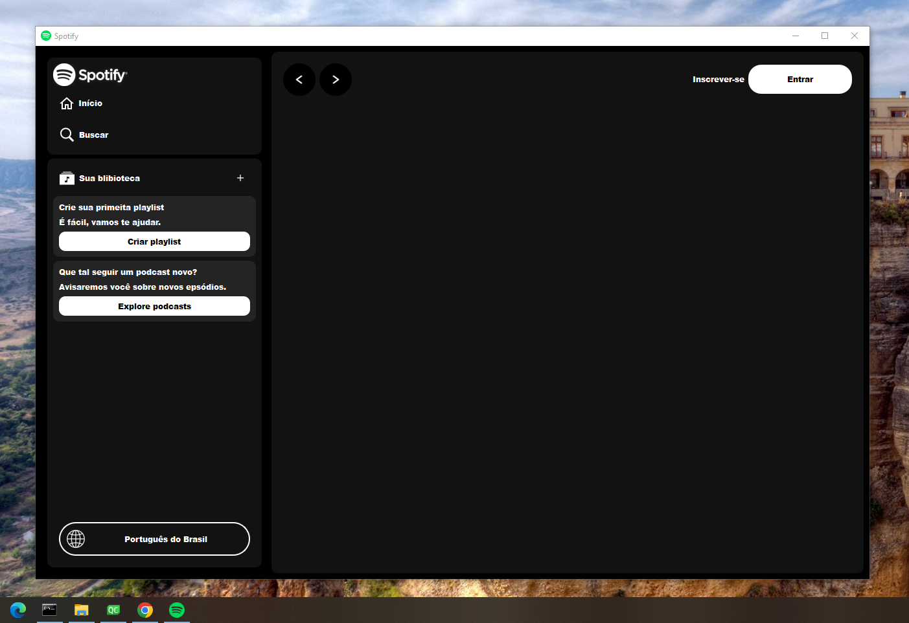

# Aplicação Simulador do Spotify com Qt e C++

Este projeto é uma aplicação que simula a interface do Spotify, desenvolvida utilizando a biblioteca Qt em C++. Ele oferece uma experiência semelhante à do aplicativo oficial do Spotify

## Funcionalidades
- Interface amigável e responsiva

## Pré-requisitos
- Qt Framework instalado
- Compilador C++

## Instalação
1. Clone o repositório: git clone https://github.com/Vinisantosz/Spotify.git

2. Compile o projeto utilizando o Qt Creator ou o compilador de sua escolha.

3. Execute o aplicativo resultante.

## Contribuindo

Contribuições são bem-vindas! Se você deseja contribuir para este projeto, siga estas etapas:

1. Faça um fork do projeto.
2. Crie uma branch para sua contribuição (`git checkout -b feature/sua-contribuicao`).
3. Faça suas alterações e commit (`git commit -am 'Adicione sua contribuição'`).
4. Faça push para a branch (`git push origin feature/sua-contribuicao`).
5. Abra um pull request.

## Contato

Linkedin: https://www.linkedin.com/in/vinicius-nascimento-dos-santos/

